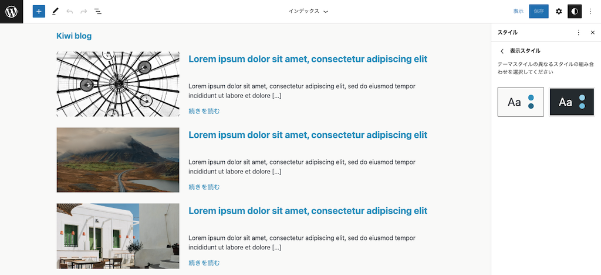

# kiwi-dev-wp-block-theme

WordPressのフルサイト編集機能に対応したブロックテーマの試作サンプルです。

## Usage
WordPress 6.1以上が必要です。

[Releases](https://github.com/kiwi-26/kiwi-dev-wp-block-theme/releases)より最新のバージョンのrelease.zipをダウンロード後、テーマをアップロードして有効化してください。

## Details
- https://kiwi-dev.com/2022/11/27/wordpress-block-editor-basic/